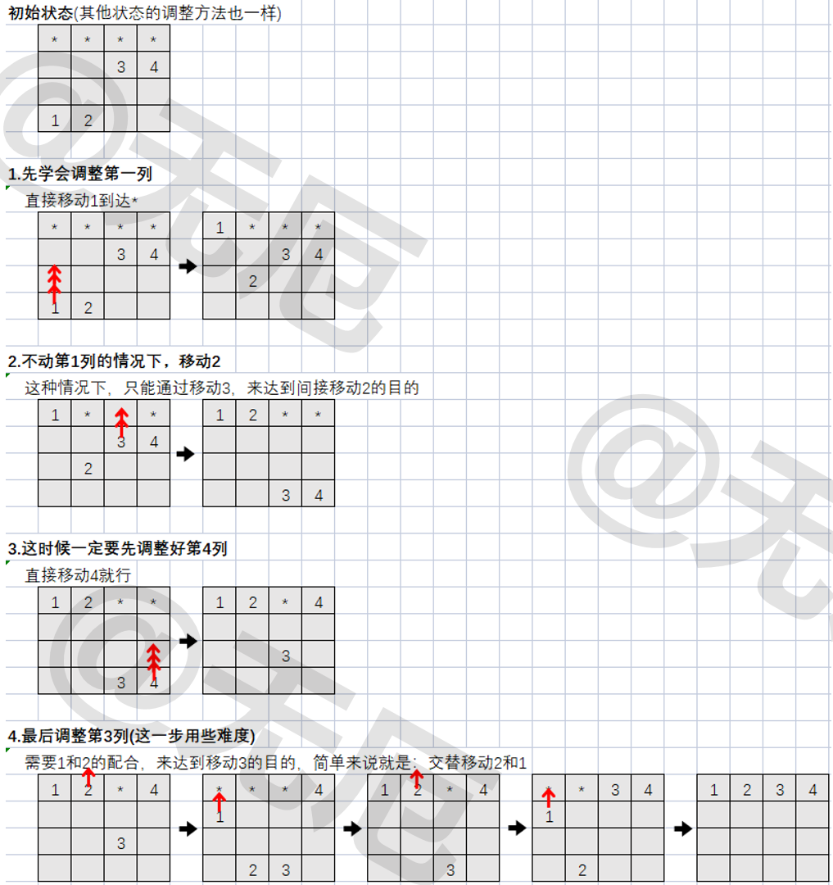

# # 烟雨江湖

## 千机塔

1. 四圣兽归位

   

   现有4圣兽：1,2,3,4 需要归位(回到*位)，已知每列均有1个机关，转动机关时，当前圣兽会向上移动(在第一行时继续向上移动会回到第四行)，同时两侧圣兽会向下移动(在第四行时继续向下移动会回到第一行)。
   
   
   
   注意：每个机关最多转动12次。
   
   
   
   
   
   
   
2. 点亮彩灯

   有一个由按钮组成的矩阵，其中每行有6个按钮，共6行。每个按钮的位置上有一盏灯。当按下一个按钮后，该按钮以及周围位置(上边、下边、左边、右边)的灯都会改变一次。即，如果灯原来是点亮的，就会被熄灭；如果灯原来是熄灭的，则会被点亮。在矩阵角上的按钮改变3盏灯的状态；在矩阵边上的按钮改变4盏灯的状态；其他的按钮改变5盏灯的状态。

   游戏链接：[DDO Vale Puzzle Solver (perfectweb.org)](http://perfectweb.org/ddo/solver/vale_puzzle.html)

   解题思路：[熄灯问题 - 详解_qianli_jiang的博客-CSDN博客_熄灯问题](https://blog.csdn.net/qianli_jiang/article/details/53420362)

   发现一个优秀的在线程序评测平台：[OpenJudge](http://openjudge.cn/)，包含很多优秀的小组：如[OpenJudge - 百练 ](http://bailian.openjudge.cn/)，[OpenJudge - NOI](http://noi.openjudge.cn/)等

